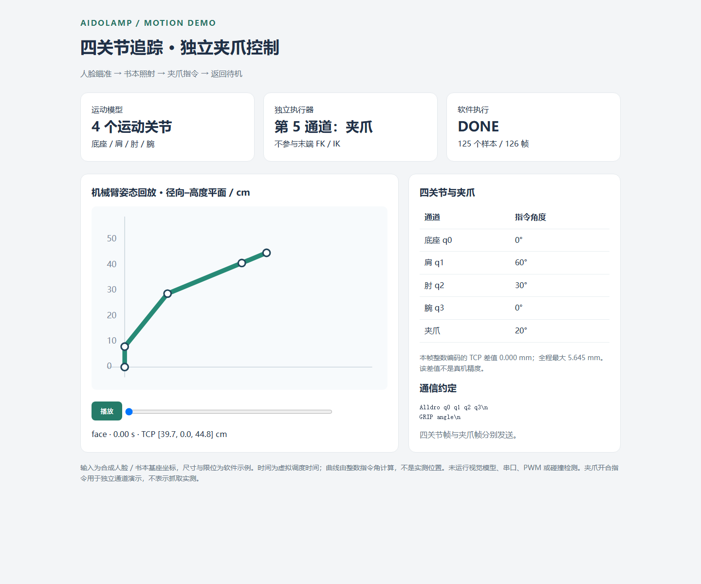
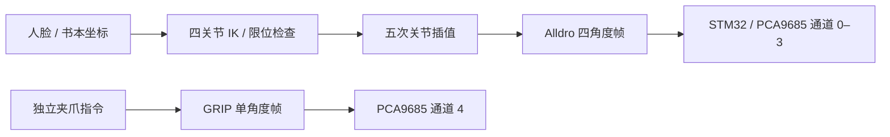

# AIDoLamp · 多模态交互与机械臂追踪智能台灯

基于 **树莓派 5 + STM32F407** 的智能台灯，集成双摄视觉、手势/坐姿识别、语音交互和机械臂照射跟踪。当前控制配置为 **四个运动关节＋独立夹爪，共五个执行通道**；提供从目标坐标、几何 IK、平滑轨迹到串口指令和固件运动处理的软件演示。

## 项目展示

| 正面：灯罩、摄像头与底座 | 侧面：机械臂与控制板 |
|:---:|:---:|
|  |  |

作品演示视频可联系作者提供。夹爪作为独立执行通道，不计入末端定位关节数。

## 一分钟运行软件演示

```bash
python -m pip install -r software-requirements.txt
python -m src.motion4dof
```

打开生成的 `output/four-axis-demo.html`，播放或拖动四关节姿态，查看底座、肩、肘、腕与独立夹爪的角度、TCP 位置及指令角量化差值。JSON 保存全部输入和指令。



演示输入为合成人脸/书本坐标，机构尺寸与限位为软件示例；不连接摄像头、串口或电机。夹爪开合指令用于展示通道隔离，不代表实测抓取结果。

## 当前能力与代码入口

| 能力 | 实现 | 入口 |
|---|---|---|
| 四关节 FK/IK | 底座偏航与肩肘腕平面几何；多解筛选、限位检查、FK 复核 | [几何模型](src/motion4dof/model.py) |
| 目标照射跟踪 | 人脸固定肩肘、求解底座与腕角；书本协调四关节位置与俯仰 | [追踪接口](src/object_tracking.py) |
| 关节轨迹 | 同步五次插值、速度约束、发送时序、失败锁存 | [轨迹与发送](src/serial_comm.py) |
| 独立夹爪 | `GRIP` 单参数指令，第五执行通道；与四关节帧分离 | [编码](src/motion4dof/protocol.py)、[固件处理](firmware/Core/Inc/lamp_motion.h) |
| 四种模式 | 待机、普通、互动、写作；多线程协调视觉与语音任务 | [主程序](src/main.py) |
| 双摄视觉 | YOLOv8 目标检测、MediaPipe 关键点与手势/坐姿分类 | [检测](src/yolo_class.py)、[联合感知](src/csi1.py) |
| 语音交互 | ASR/TTS、唤醒与 DeepSeek 对话接口 | [语音模块](src/voice_class.py) |
| 推理部署资料 | YOLOv8n 训练、ONNX 导出与 ONNX Runtime 实验 | [部署资料](training/yolo/identify_pi/) |



[模型、协议与实际测试](docs/four-axis-motion.md) · [能力与简历对应](docs/capability-map.md) · [视觉与调度说明](docs/motion-control.md)

## 软件测试

```bash
python -m unittest discover -s tests -v
python -m src.motion4dof --fault unreachable --output output/unreachable.json
python -m src.motion4dof --fault transport --output output/transport.json
python -m src.motion4dof --fault estop --output output/estop.json
```

本地 **24 项测试通过，无跳过**；四关节测试包含 300 组随机 FK/IK 往返、人脸/书本瞄准、夹爪独立性、串口短写和固件运动处理函数的主机 C 测试。正常演示生成 **125 个样本、126 帧指令**。不可达目标零下发；模拟串口失败与急停停止后续指令，返回码为 2。

固件测试用主机 GCC 编译实际 `lamp_motion.h`，核对通道与角度，不执行 PWM。另有 14 项[六轴补充算法](docs/six-axis-motion.md)测试，对应独立数学示例。

## 硬件运行入口

四个运动关节对应底座、肩、肘、腕，PCA9685 通道 0–3；夹爪默认通道 4。上位机的 `send_servos_smooth([q0,q1,q2,q3])` 与 `send_gripper(angle)` 分别发送运动和夹爪帧。角度零位、方向、接线与夹爪行程需按实物校准。

树莓派安装匹配的摄像头和推理依赖，准备 `models/` 所需模型及 `.env` 配置后，从项目根目录启动：

```bash
python -m pip install -r requirements.txt
python src/main.py
```

主程序加载路径和模型配置需按部署环境核对。两个 CSI 摄像头分别承担目标检测和手势/坐姿感知，不等同于已完成双目立体测距。四种模式与语音模块沿用已有入口，新增夹爪由显式 API 指令控制，不把手势动作擅自改成夹爪动作。

## 验证范围

当前 FK/IK 只求本构型可实现的位置与俯仰，不能任意指定六维末端姿态。模型统一拒绝不可达目标，不通过裁剪角度宣称准确到位。

软件测试覆盖数学模型、指令生成与完整帧处理。已发送角度为指令估计；物理精度、碰撞、DMA 收包和执行时序不属于该测试范围。接口约束集中见[模型与协议说明](docs/four-axis-motion.md)。

ONNX Runtime 资料对应 YOLO 部署实验，手势模块使用 MediaPipe 关键点与分类器。

## 许可

见 [LICENSE](LICENSE)，外部模型和框架遵循各自许可证。
